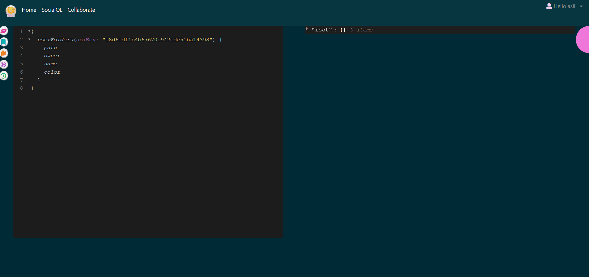

[JotFormQL Web Deployment](https://graphql-jotform.herokuapp.com/)
[](https://travis-ci.org/AsliUral/GraphQL-JotForm)

[](https://github.com/AsliUral/GraphQL-JotForm/blob/master/LICENSE)


[](https://github.com/Naereen/badges/)

# [JotFormQL](#)

_GraphQL is a query language for APIs and a runtime for fulfilling those queries with your existing data. GraphQL provides a complete and understandable description of the data in your API, gives clients the power to ask for exactly what they need and nothing more, makes it easier to evolve APIs over time, and enables powerful developer tools._

_The project goal is feeding already used JotForm API with GraphQL and Apollo which is GraphQL server and GraphQL client._

## Technologies:

Project is created with:

-   React
-   Redux
-   GraphQL
-   Bootstrap
-   Semantic-ui-react
-   Apollo
-   Firebase

    Test is created with:

-   Jest

## KeyWords:

-   Hierarchical
-   Product-centric
-   Strong-typing
-   Client-specified queries
-   Introspective

## Who's it for?

-   JotForm Intern
-   Tech Consumers

## Why build it?

-   A lots of intern works in JotForm. Almost every intern use JotForm api for their project. Each of them make almost same query in the api.
    Our purpose:
    -   easily make a filter on the query
    -   easily save query
    -   easily share query in the JotForm
-   GraphQL calls are handled in a single round trip. JotForm developer get what they request with no overfetching.
-   Strongly defined data types reduce miscommunication between the client and the server.
-   Simplicity comes a more elegant methodology and experience concerning data retrieval.
-   Everything is available from a single endpoint

## Project Component Relation Diagram:


-   JotFormQL consists of two sub-products.The Query Editor is shown first, then Socail Ql.

## JotFormQL Query Editor:

-   Query can be written
-   When writing a query, hint options and documentation can be used.
-   The prettify feature can be used when writing a query.
-   Query can be run
-   After the query is run, query is displayed in history.
-   Query can be copied.



## JotFormQL SocialQL:

-   Query can be posted.
-   Tags can be added while posting the query
-   Can be searched with query tag in SocialQL
-   Posted queries can be viewed and run
-   Query can be starred
-   Every user can create a channel
-   Users can send emoji and see typing during conversations on the channel
-   Users who are online may appear
-   Stared queries and queries belonging to the user can be found in the Your Stars section


## File Tree

```
📦src
┣ 📂components
┃ ┣ 📂auth
┃ ┃ ┣ 📜SignIn.js
┃ ┃ ┗ 📜SignUp.js
┃ ┣ 📂collaborate
┃ ┃ ┣ 📜collaborate.js
┃ ┃ ┗ 📜editorCollaborate.js
┃ ┣ 📂layout
┃ ┃ ┣ 📜Navbar.js
┃ ┃ ┣ 📜NavbarButton.css
┃ ┃ ┣ 📜SignedInLinks.js
┃ ┃ ┗ 📜SignedOutLinks.js
┃ ┣ 📂social
┃ ┃ ┣ 📜Channels.js
┃ ┃ ┣ 📜DirectMessages.js
┃ ┃ ┣ 📜Messages.js
┃ ┃ ┣ 📜MessagesForm.js
┃ ┃ ┣ 📜MessagesHeader.js
┃ ┃ ┣ 📜SidePanel.js
┃ ┃ ┣ 📜SortMessage.js
┃ ┃ ┣ 📜Typing.js
┃ ┃ ┗ 📜TypingDiv.js
┃ ┣ 📜CopyToClipboard.js
┃ ┣ 📜Dashboard.js
┃ ┣ 📜Editor.js
┃ ┣ 📜EditorAceQuery.js
┃ ┣ 📜EditorAceResult.js
┃ ┣ 📜EditorQueryHint.js
┃ ┣ 📜HistoryModal.js
┃ ┣ 📜Loader.js
┃ ┣ 📜Navbar.js
┃ ┣ 📜Prettify.js
┃ ┣ 📜QueryData.js
┃ ┣ 📜QueryMark.js
┃ ┣ 📜QueryPlay.js
┃ ┣ 📜QueryResult.js
┃ ┣ 📜QueryShare.js
┃ ┣ 📜QueryValidate.js
┃ ┣ 📜SearchQuery.js
┃ ┣ 📜SideBar.js
┃ ┣ 📜SideBarButton.js
┃ ┣ 📜SideBarContent.js
┃ ┣ 📜SideBarMarkedQueryTab.js
┃ ┣ 📜SideBarPin.js
┃ ┣ 📜SideBarSchemaTab.js
┃ ┣ 📜SideBarTabView.js
┃ ┣ 📜SideBarUnPin.js
┃ ┣ 📜SocialQL.js
┃ ┗ 📜StarQuery.js
┣ 📂config
┃ ┗ 📜fbConfig.js
┣ 📂containers
┃ ┣ 📜ChannelContainer.js
┃ ┣ 📜CopyToClipboardContainer.js
┃ ┣ 📜DashboarContainer.js
┃ ┣ 📜DirectMessageContainer.js
┃ ┣ 📜EditorAceQueryContainer.js
┃ ┣ 📜EditorAceResultContainer.js
┃ ┣ 📜EditorCollaborateContainer.js
┃ ┣ 📜HistoryModalContainer.js
┃ ┣ 📜MessagesContainer.js
┃ ┣ 📜MessagesFormContainer.js
┃ ┣ 📜MessagesHeaderContainer.js
┃ ┣ 📜NavbarContainer.js
┃ ┣ 📜PrettifyContainer.js
┃ ┣ 📜QueryDataContainer.js
┃ ┣ 📜QueryMarkContainer.js
┃ ┣ 📜QueryPlayContainer.js
┃ ┣ 📜ShareQueryContainer.js
┃ ┣ 📜SideBarButtonContainer.js
┃ ┣ 📜SideBarContainer.js
┃ ┣ 📜SideBarContentContainer.js
┃ ┣ 📜SideBarMarkedQueryTabContainer.js
┃ ┣ 📜SideBarPinContainer.js
┃ ┣ 📜SideBarSchemaTabContainer.js
┃ ┣ 📜SideBarUnPinContainer.js
┃ ┣ 📜SignInContainer.js
┃ ┣ 📜SignInLinkContainer.js
┃ ┣ 📜SignUpContainer.js
┃ ┣ 📜SocialQLContainer.js
┃ ┗ 📜StarQueryContainer.js
┣ 📂store
┃ ┣ 📜actions.js
┃ ┣ 📜authActions.js
┃ ┣ 📜authReducer.js
┃ ┣ 📜channelActions.js
┃ ┣ 📜channelReducer.js
┃ ┣ 📜collaborateActions.js
┃ ┣ 📜collaborateReducer.js
┃ ┣ 📜messageActions.js
┃ ┣ 📜messageReducer.js
┃ ┣ 📜reducer.js
┃ ┗ 📜rootReducer.js
┣ 📂style
┃ ┣ 📜Sidebar.css
┃ ┣ 📜SideBarInsert.css
┃ ┣ 📜Sign.css
┃ ┣ 📜SocialQl.css
┃ ┗ 📜stylem.css
┣ 📂test
┃ ┣ 📜QueryValidate.test.js
┃ ┗ 📜SortMessage.test.js
┣ 📜App.css
┣ 📜App.js
┣ 📜App.test.js
┣ 📜graphqlSchema.json
┣ 📜index.css
┣ 📜index.js
┣ 📜schema.js
┗ 📜serviceWorker.js
```

### Powered By

[Aslı Ural](https://github.com/AsliUral)
